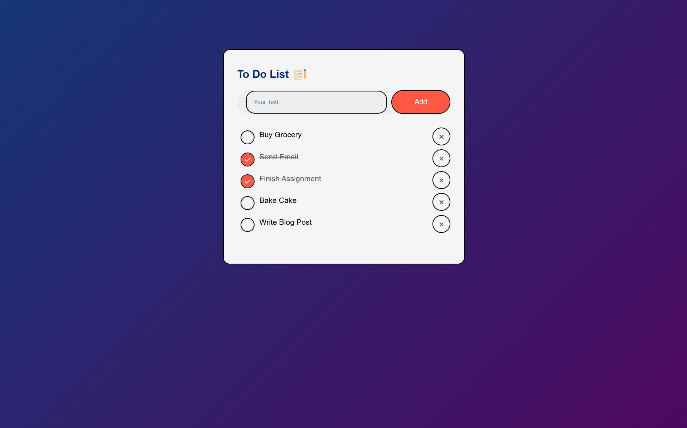

# 📝 To-Do List Web App ✅  



An interactive and minimal To-Do List application to help users manage daily tasks with ease. Add, edit, delete, and mark tasks as complete — all with a clean UI and smooth experience.

## Table of Contents
 - [Features](#features)
 - [Installation](#installation)
 - [Usage](#usage)
 - [Functionality](#functionality)
 - [Tech Stack](#tech-stack)
 - [Project Structure](#project-structure)
 - [Website Link](#website-link)

## Features 

- **Task Management**:
  - Add new tasks with a single click
  - Edit existing tasks in-line
  - Mark tasks as completed
  - Delete tasks with ease

- **UI/UX Highlights**:
  - Responsive design across devices
  - Clean interface with soft animations
  - Dynamic task count display

- **Storage**:
  - Tasks persist using **Local Storage**
  - Auto-syncs without database or backend

## Installation

1. Clone the repository:
   ```bash
   git clone https://github.com/yourusername/To-Do-List.git
   ```

2. Navigate to the project folder:
   ```bash
   cd To-Do-List
   ```

3. Open `index.html` in your browser.

## Usage

- Type your task into the input field and press **Enter** or click **Add**.
- Use the checkbox to **mark as complete**.
- Click the **edit icon** to modify a task.
- Click the **delete icon** to remove a task.
- Tasks remain even after refreshing the page thanks to **local storage**.

## Functionality

- **Add Task** — Instantly adds a new task to your list.
- **Delete Task** — Removes task permanently.
- **Mark Complete** — Strikethrough effect and status toggle.
- **Persistent Storage** — No data loss on refresh.

## Tech Stack

- **HTML5**
- **CSS3** (Flexbox, Grid, Animations)
- **JavaScript (ES6)** — DOM manipulation and storage

## Project Structure
```bash
to-do-list-app/
├── index.html
├── style.css
├── scripts.js
├── images/
```

## Website Link

🔗 [Visit the App](https://to-do-list-navy-one-60.vercel.app/)
